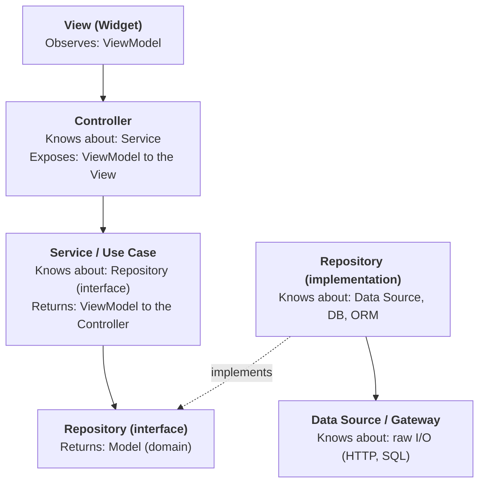
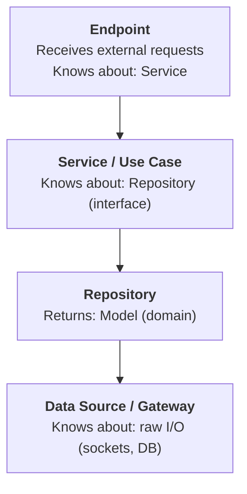

# Layered Architecture

A classic pattern that enforces separation of concerns by organizing code into horizontal layers, each with a single responsibility. The golden rule is: **dependencies flow downward only** — a layer can only call the layer directly below it, never upward or sideways.

## Overview



### Key Rules

1. **Depend on abstractions.** The Service depends on `OrderRepository` (the abstract class), not `SqliteOrderRepository`. This makes swapping storage trivial — say, from SQLite to Drift or PostgreSQL.

2. **Models are pure.** Your `OrderModel`, `ProductModel`, etc. should be plain Dart classes with no framework imports, no annotations, no JSON keys. Mapping happens at the repository boundary. ViewModels are separate classes shaped for what the UI needs to display — the Service is responsible for this mapping.

3. **One direction only.** If your Repository ever imports a Widget or a ViewModel, or your Service returns an HTTP status code, something has crossed a boundary it shouldn't.

4. **Services orchestrate, repositories operate.** If an operation touches two repositories, the Service coordinates them — a repository should never call another repository.

---

## The Layers

### 1. Controller (+ View and ViewModel — MVVM)

The UI follows the MVVM (Model-View-ViewModel) pattern. The **View** is the Flutter `Widget` tree — it observes a **ViewModel** and renders accordingly, but contains no logic beyond building UI. The **Controller** sits between the View and the Service layer: it receives user interactions from the View, calls Services, and updates the ViewModel that the View is observing.

**View responsibilities:**

- Render UI based on the current ViewModel state.
- Forward user interactions to the Controller.
- Contain zero business or orchestration logic.

**Controller responsibilities:**

- Receive user input from the View.
- Validate input format (not business rules — just "is this even parseable?").
- Call the appropriate service method.
- Update the ViewModel with the result for the View to observe.

**It should NOT:** contain business logic, talk to a database, or know how data is stored.

```dart
// The ViewModel — a plain data class the View observes
class OrderViewModel {
  final String orderId;
  final String statusLabel;
  final String formattedTotal;
  final List<OrderItemViewModel> items;

  const OrderViewModel({
    required this.orderId,
    required this.statusLabel,
    required this.formattedTotal,
    required this.items,
  });
}

// The Controller — mediates between View and Service
class OrderController {
  final OrderService _service;

  OrderController(this._service);

  Future<void> placeOrder(OrderFormData form) async {
    // Light input validation (format-level)
    if (form.items.isEmpty) throw EmptyCartException();

    // Delegate to service — receives a ViewModel back
    final viewModel = await _service.createOrder(
      items: form.items,
      customerId: form.customerId,
    );

    // Update state for the View to observe
    state = OrderPlaced(viewModel);
  }
}
```

---

### 2. Service (Business Logic / Use Case)

The heart of your app. This is where domain rules live. Services receive **Models** from Repositories, apply business logic, and return **ViewModels** shaped for the Controller/UI to consume.

**Responsibilities:**

- Orchestrate business operations (often spanning multiple repositories).
- Enforce business rules and invariants.
- Handle transactions and rollback logic.
- Map Models to ViewModels before returning to the Controller.
- Emit domain events if needed.

**It should NOT:** know about HTTP, widgets, SQL, or any infrastructure detail.

```dart
class OrderService {
  final OrderRepository _orderRepo;
  final InventoryRepository _inventoryRepo;
  final PaymentGateway _payment;

  OrderService(this._orderRepo, this._inventoryRepo, this._payment);

  Future<OrderViewModel> createOrder({
    required List<OrderItem> items,
    required String customerId,
  }) async {
    // Business rule: check stock
    for (final item in items) {
      final available = await _inventoryRepo.getStock(item.productId);
      if (available < item.quantity) {
        throw InsufficientStockException(item.productId);
      }
    }

    // Business rule: calculate total with discounts
    final total = _calculateTotal(items);

    // Orchestration: charge, then persist
    await _payment.charge(customerId, total);
    final order = OrderModel(
      items: items,
      total: total,
      status: OrderStatus.confirmed,
    );
    final saved = await _orderRepo.save(order);

    // Map Model → ViewModel for the Controller
    return OrderViewModel(
      orderId: saved.id,
      statusLabel: saved.status.label,
      formattedTotal: _formatCurrency(saved.total),
      items: saved.items.map(_toItemViewModel).toList(),
    );
  }
}
```

---

### 3. Repository (Data Access)

The boundary between your business logic and the outside world of persistence. It abstracts where and how data is stored. Repositories deal exclusively in **Models** — plain domain objects that represent your data without any UI concern.

**Responsibilities:**

- CRUD operations on a single aggregate or entity.
- Translate between Models and storage format (DB rows, JSON, etc.).
- Encapsulate query logic (SQL, Drift, Firestore calls, etc.).

**It should NOT:** contain business rules, call other repositories, or know about ViewModels.

> **Note:** This is also the primary layer for caching domain data. See [Caching](#caching) for the recommended decorator pattern.

```dart
abstract class OrderRepository {
  Future<OrderModel> save(OrderModel order);
  Future<OrderModel?> findById(String id);
  Future<List<OrderModel>> findByCustomer(String customerId);
}

// Concrete implementation — this is the only place that knows about SQLite
class SqliteOrderRepository implements OrderRepository {
  final Database _db;

  SqliteOrderRepository(this._db);

  @override
  Future<OrderModel> save(OrderModel order) async {
    await _db.insert('orders', order.toMap());
    return order;
  }
}
```

---

### 4. Data Source / Gateway (optional)

If your repository already feels thin, you can skip this. But when you have multiple data sources (local DB + remote API + cache), this layer helps.

**Responsibilities:**

- Raw I/O: HTTP calls, SQL queries, file reads.
- Serialization and deserialization (JSON to Map and back).
- Raw response caching (ETag/304 logic, HTTP cache headers).
- Retry logic, connection pooling.

```dart
class OrderRemoteDataSource {
  final HttpClient _client;

  Future<Map<String, dynamic>> fetchOrder(String id) async {
    final response = await _client.get('/orders/$id');
    return jsonDecode(response.body);
  }
}
```

---

## Caching

Caching belongs primarily at the **Repository** level. The Repository already abstracts where data comes from, so it's the natural place to intercept reads and serve cached Models transparently — the Service never needs to know.

A clean approach is the **decorator pattern**: a caching repository that wraps the real one.

```dart
class CachedOrderRepository implements OrderRepository {
  final OrderRepository _inner; // the real SqliteOrderRepository
  final Cache _cache;

  CachedOrderRepository(this._inner, this._cache);

  @override
  Future<OrderModel?> findById(String id) async {
    final cached = _cache.get<OrderModel>('order:$id');
    if (cached != null) return cached;

    final model = await _inner.findById(id);
    if (model != null) _cache.set('order:$id', model);
    return model;
  }

  @override
  Future<OrderModel> save(OrderModel order) async {
    final saved = await _inner.save(order);
    _cache.set('order:${saved.id}', saved); // update cache on write
    return saved;
  }
}
```

Since `CachedOrderRepository` implements `OrderRepository`, swapping it in is just a DI binding change — no Service code is modified.

**Exceptions:**

- **Data Source level:** Raw HTTP response caching (ETag/304 logic, response body caching) belongs here since it's an I/O concern, not a domain concern.
- **Service level:** Rarely needed, but if the Model-to-ViewModel transformation is expensive (heavy aggregation across multiple repos), you could cache the ViewModel result here. This is uncommon.

As a rule of thumb: cache **Models** at the Repository, cache **raw responses** at the Data Source. Avoid caching ViewModels unless you have a specific performance reason to.

---

## Server-Side / Headless Variant

The layers above are written UI-first, with MVVM at the top. For a headless context — a daemon, server, or background service with no UI — the top of the stack changes, but everything from the Service layer down stays identical.

### The Endpoint replaces the UI trio

With no UI, there is no View to render and no ViewModel state to hold. The `View → ViewModel → Controller` trio collapses into a single **Endpoint** — the inbound entry point that receives external requests (a socket handler, an RPC method, an HTTP route, a CLI command) and translates them into Service calls.



**Endpoint responsibilities:**

- Receive an external request and parse/validate its format.
- Call the appropriate Service method.
- Serialize the Service result back to the caller.

It plays the same structural role the Controller plays on the UI side — it just talks to a wire protocol instead of a View. Services and below do not change; they have no idea whether an Endpoint or a Controller sits above them.

### Upward events: dependency direction vs. data flow

A daemon often pushes events on its own (acknowledgements, state changes, takeovers) rather than only responding to requests. These originate at the bottom and must reach the top, which looks like it contradicts the "dependencies flow downward only" rule. It does not — because **dependency direction and data flow direction are separate concerns:**

- **Dependency direction** (compile-time: who imports whom) stays strictly downward. A lower layer never imports a type from an upper layer.
- **Data flow direction** (runtime: which way information travels) may go either way.

Upward data flow without upward dependency is achieved with **per-layer Streams** (the Observer pattern). Each layer exposes its own `Stream` of events and emits into it, knowing nothing about who listens. The layer directly above subscribes. Events bubble up one layer at a time, mirroring the way requests flow down.

```dart
// Data Source — emits events; knows nothing about subscribers
class DaemonDataSource {
  final _events = StreamController<DaemonEvent>.broadcast();
  Stream<DaemonEvent> get events => _events.stream;

  void _onSocketData(List<int> bytes) {
    _events.add(LayoutChangedEvent(/* ... */)); // flows up, no upward import
  }
}

// Repository — depends DOWN on the Data Source, re-exposes domain events up
class LayoutRepository {
  LayoutRepository(this._dataSource);
  final DaemonDataSource _dataSource;

  Stream<LayoutModel> get layoutChanges =>
      _dataSource.events.whereType<LayoutChangedEvent>().map(_toModel);
}

// Service — depends DOWN on the Repository, subscribes to its stream
class LayoutService {
  LayoutService(this._repo) {
    _repo.layoutChanges.listen(_handleLayoutChange);
  }
  final LayoutRepository _repo;
}
```

Every dependency arrow still points down; the events travel up through the per-layer streams. **Streams are layered the same way calls are** — no shared/global event bus that would let a lower layer reach across boundaries. A layer subscribes only to the stream of the layer directly below it, re-shaping and re-emitting its own stream for the layer above when the event needs to travel further.

---

## Scaling Guidance

This structure scales well. In a small app, you might only need Controller → Service → Repository. As complexity grows, you add Data Sources, domain events, or even a dedicated Domain layer with entities and value objects (which is when you get into full Clean Architecture territory). Start simple, add layers only when the pain justifies it.
